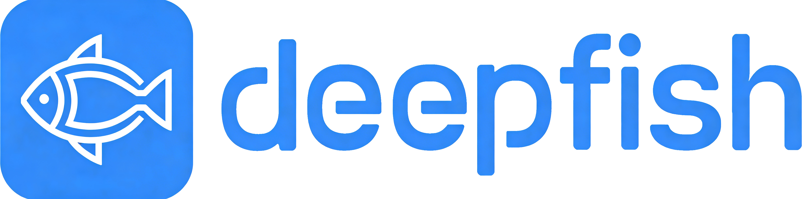

<div align="center" style="display:flex;align-items: center;justify-content: center;">
  
</div>

---

<div align="center" style="line-height: 1">
  
  
  <a href="https://github.com/qq306863030/deepfish-ai">
    </a>
  <a href="https://www.npmjs.com/package/deepfish-ai">
    </a>
  
</div>


- [English](README_EN.md) | [中文](README.md)

## Table of Contents

- [Table of Contents](#table-of-contents)
- [1. Introduction](#1-introduction)
- [2. Installation](#2-installation)
  - [Prerequisites](#prerequisites)
  - [Install via npm](#install-via-npm)
  - [Install from source](#install-from-source)
- [3. Quick Start](#3-quick-start)
- [4. Command Reference](#4-command-reference)
  - [Basic Chat](#basic-chat)
  - [Configuration](#configuration)
  - [Model Management](#model-management)
  - [Skill Management](#skill-management)
  - [Tool Management](#tool-management)
  - [Session Management](#session-management)
  - [Task Management](#task-management)
  - [MCP Management](#mcp-management)
  - [Serve Management](#serve-management)
  - [Cache Management (AI Self-Learning Cache)](#cache-management-ai-self-learning-cache)
- [5. MCP Extension Configuration](#5-mcp-extension-configuration)
  - [Configuration Example](#configuration-example)
- [6. Contributing](#6-contributing)
- [7. License](#7-license)
- [8. Support](#8-support)

## 1. Introduction

An efficient AI-driven command-line tool designed to bridge the gap between natural language and operating system commands, file operations, and more. It enables non-developers to quickly generate executable instructions through simple natural language descriptions, significantly improving terminal operation efficiency.

Core Features:

- **Multi-Model Compatibility**: Seamlessly supports DeepSeek, Ollama, and all AI models following the OpenAI API specification. Switch between models flexibly to adapt to different scenarios.

- **Natural Language to Command**: Accurately parses natural language requests and automatically converts them into corresponding operating system commands (Linux, Windows, macOS terminal commands) and file operation instructions (create, delete, modify files/directories), eliminating the need to write complex commands manually.

- **Skill Extension**: Skills are AI workflow knowledge packages defined via Markdown files that encapsulate best practices for specific domains. After installing a Skill, AI automatically follows its guidelines to execute tasks, such as code review workflows, document generation templates, etc. Compatible with the OpenClaw Skill ecosystem, installable and manageable via `ai skills` commands.

- **Tool Extension**: Tools are custom function tools callable by AI, defined via TypeScript files. You can write Tools to extend AI's capabilities, such as calling third-party APIs, operating databases, processing specific file formats, etc. Supported by `ai tools generate` for AI-powered automatic Tool generation, lowering the development barrier.

- **MCP Extension**: MCP (Model Context Protocol) is a standardized model context protocol that allows AI to connect to external tools and data sources. By configuring MCP Servers, AI gains capabilities like browser automation, database queries, file system access, and more. DeepFish has built-in MCP support—just simple configuration to integrate various MCP services.

- **Highly Extensible**: Supports an extension mechanism to expand functionality boundaries. Beyond basic terminal and file operations, you can easily implement translation, novel writing, file format conversion, data processing, and other complex tasks to meet diverse needs.

- **AI-Generated Extensions**: No need to manually develop complex extension tools—generate custom extensions directly through AI, lowering the barrier to extending functionality and making it more efficient and flexible. [Extension Examples](https://github.com/qq306863030/deepfish-extensions)

Suitable for developers, operations personnel, and everyday terminal users. Whether it's quickly executing terminal operations, batch processing files, or implementing personalized needs through extensions, this tool simplifies workflows and improves efficiency, bringing AI to every terminal operation.


## 2. Installation

### Prerequisites

- Node.js (v22.14.0 or higher)
- npm or yarn

### Install via npm

```bash
npm install -g deepfish-ai
```

### Install from source

```bash
git clone https://github.com/qq306863030/deepfish-ai.git
cd deepfish
npm install
npm link
```

## 3. Quick Start

```bash
ai models add # Enter name, then enter your model configuration
ai config use your-model-name
ai "Write an article about future technology in the current directory, output in markdown format"
```

## 4. Command Reference

### Basic Chat

```bash
ai "your question or instruction"
```

Enter natural language directly, and AI will automatically parse and execute the corresponding operations.

### Configuration

| Command | Description |
|---------|-------------|
| `ai config edit` | Edit configuration file |
| `ai config view` | View current configuration |
| `ai config reset` | Reset configuration |
| `ai config dir` | View configuration directory |

### Model Management

| Command | Description |
|---------|-------------|
| `ai models add` | Add a new model |
| `ai models ls` | List all models |
| `ai models use <name>` | Switch the model in use |
| `ai models del <name>` | Delete specified model |

### Skill Management

| Command | Description |
|---------|-------------|
| `ai skills ls` | List all Skills |
| `ai skills add <name>` | Add a Skill |
| `ai skills del <index>` | Delete specified Skill |
| `ai skills enable <name\|index>` | Enable a Skill |
| `ai skills disable <name\|index>` | Disable a Skill |
| `ai skills dir` | View Skill directory |
| `ai skills generate xxx` | Generate a Skill via AI |

### Tool Management

| Command | Description |
|---------|-------------|
| `ai tools dir` | View tool directory |
| `ai tools generate xxx` | Generate a tool via AI |

### Session Management

| Command | Description |
|---------|-------------|
| `ai session clear` | Clear session history |
| `ai session dir` | View session directory |

### Task Management

| Command | Description |
|---------|-------------|
| `ai task ls` | List all tasks |
| `ai task add <task>` | Add a task |
| `ai task del <index>` | Delete specified task |
| `ai task clear` | Clear all tasks |

### MCP Management

| Command | Description |
|---------|-------------|
| `ai mcp edit` | Edit MCP configuration |

### Serve Management

| Command | Description |
|---------|-------------|
| `ai serve` | Start the service |
| `ai serve start` | Start the service |
| `ai serve stop` | Stop the service |
| `ai serve restart` | Restart the service |

### Cache Management (AI Self-Learning Cache)

| Command | Description |
|---------|-------------|
| `ai cache ls` | List cache |
| `ai cache edit <index\|id>` | Edit cache entry |
| `ai cache del <index\|id>` | Delete cache entry |

## 5. MCP Extension Configuration

MCP (Model Context Protocol) allows AI to connect to external tools and services. Edit the MCP configuration file via `ai mcp edit` command to add the MCP Servers you need.

### Configuration Example

The following example configures a Chrome DevTools MCP Server, enabling AI to perform browser automation:

```json
{
  "mcpServers": {
    "chrome-devtools": {
      "command": "npx",
      "args": ["-y", "chrome-devtools-mcp@latest"]
    }
  }
}
```

After configuration, AI will automatically load the tools provided by the MCP Server, and you can directly instruct AI to use these capabilities in your conversations.

## 6. Contributing

Contributions are welcome! Feel free to submit Pull Requests at any time.

## 7. License

This project is licensed under the MIT License - see the [LICENSE](LICENSE) file for details.

## 8. Support

For questions and inquiries, please submit an issue on the GitHub repository.

